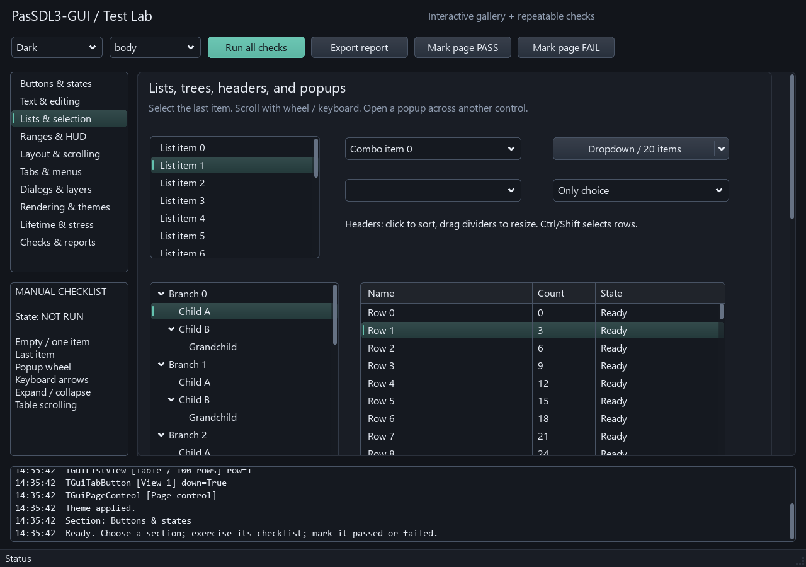
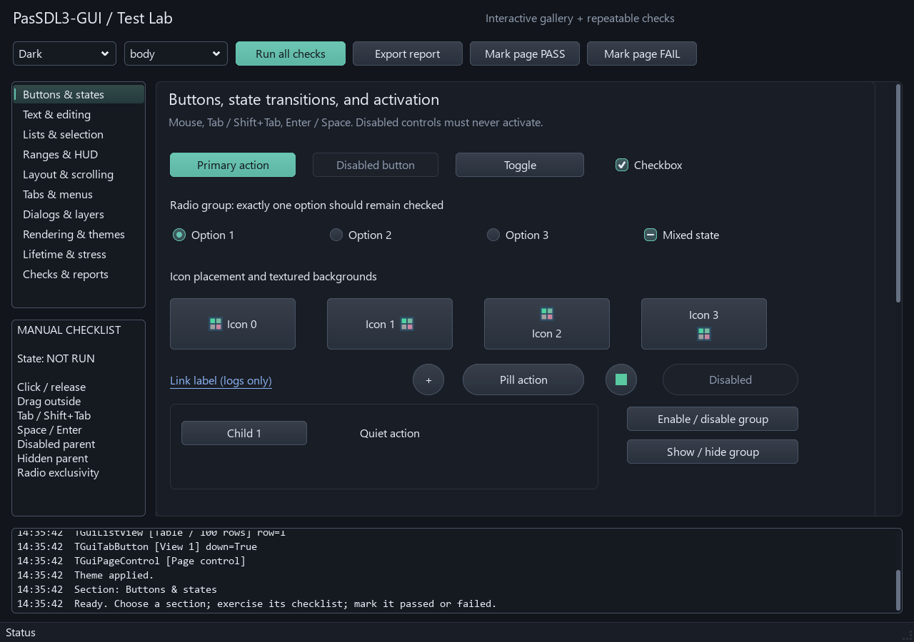
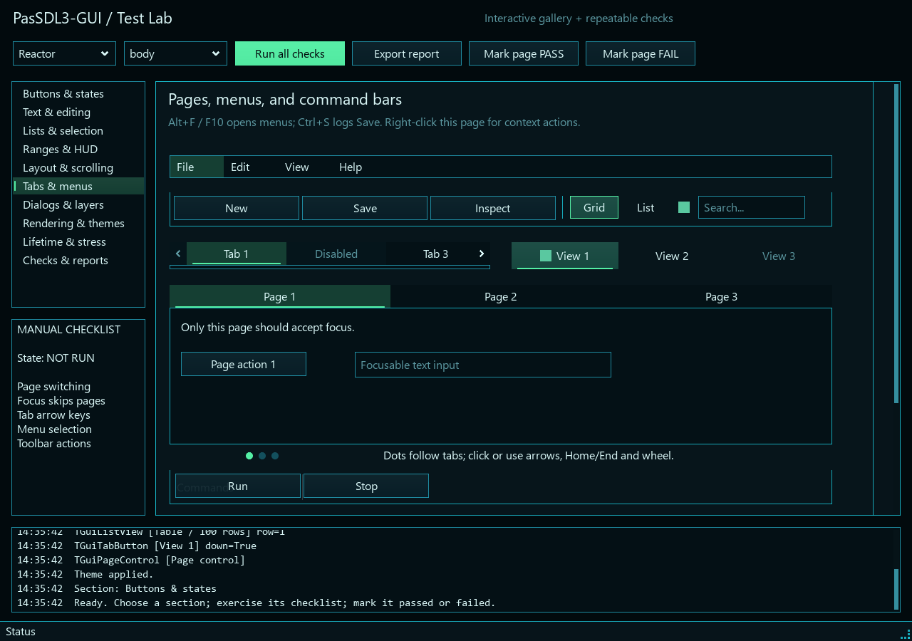
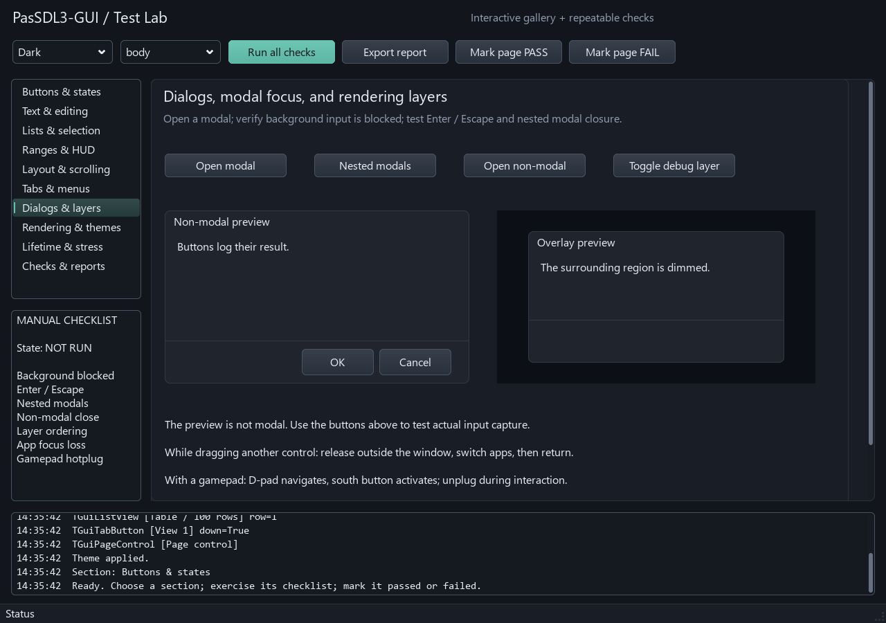

# PasSDL3-GUI

[](https://github.com/nalilord/PasSDL3-GUI/actions/workflows/quality.yml)
[](LICENSE)
[](https://github.com/nalilord/PasSDL3-GUI)
[](https://www.libsdl.org/)

A native retained-mode GUI toolkit for SDL3 games, tools, menus, overlays, and
HUDs—written in Object Pascal and tested with Delphi Win64 and Free Pascal
Linux64.

PasSDL3-GUI keeps controls as persistent objects owned by their parent. It is
designed for applications that want a conventional control tree and event model
on top of an SDL renderer, rather than an immediate-mode API.



<table>
  <tr>
    <td></td>
    <td></td>
  </tr>
  <tr>
    <td align="center">Dark theme controls and states</td>
    <td align="center">Reactor theme pages and menus</td>
  </tr>
</table>

## Highlights

- 60 public visual control classes, from buttons and editors to lists, trees,
  tables, menus, tabs, dialogs, charts, progress controls, and layout containers.
- Mouse, keyboard, text-input/composition, clipboard, focus, modal, shortcut,
  tooltip, scrolling, and gamepad routing through SDL3.
- Anchoring, alignment, stack/grid layout, nested scrolling, clipping, layers,
  popups, movable/resizable dialogs, and callback-safe ownership handling.
- Dark and Reactor themes, rounded surfaces, gradients, focus treatment,
  drawables, textures, nine-slice resources, and INI theme persistence.
- Ordinary Unicode editing with Unicode 17 grapheme boundaries, selection,
  undo/redo, password input, memo wrapping, and SDL composition previews.
- Responsibility-based control units with a small foundation and enforced acyclic
  dependencies. Import the full facade or only the category you need.
- A comprehensive interactive Test Lab plus repeatable API, behavior, rendering,
  XML, ownership, lifetime, and example smoke tests.

## Status

The completed control implementation and structural refactor are covered by fresh
Delphi 36 Win64 and FPC 3.2.2 Linux64 acceptance runs. The final Test Lab capture
suite reports 406 passed checks and includes both stock themes.

The XML loader is intentionally Delphi-only. Automated tests do not claim physical
gamepad, native IME candidate-window, native cursor, clipboard, or mixed-DPI
hardware certification. The Test Lab guide lists the corresponding interactive
checks without treating headless automation as physical-device validation.

## Requirements

- Delphi with a Win32/Win64 command-line compiler, or Free Pascal 3.2.2+
- SDL3 and SDL3_ttf native runtime libraries
- Bash for the supplied build/test scripts; WSL is supported for driving Delphi
  builds from Windows

`Lib/SDL3` is a Git submodule pinned to
[nalilord/SDL3-for-Pascal](https://github.com/nalilord/SDL3-for-Pascal), the
Delphi-capable fork used by this project. PasSDL3-GUI therefore records one exact
binding revision without duplicating its sources. Native DLL/shared libraries are
intentionally not stored in this repository.

On Windows, place `SDL3.dll` and `SDL3_ttf.dll` beside the built executable—for
the default scripts, that is normally `Bin/Win64`. On Linux, install compatible
`libSDL3` and `libSDL3_ttf` libraries in the compiler/runtime search path. Official
native packages are available from the
[SDL releases](https://github.com/libsdl-org/SDL/releases) and
[SDL_ttf releases](https://github.com/libsdl-org/SDL_ttf/releases).

## Quick start

Clone the repository and build the basic example:

```sh
git clone --recurse-submodules https://github.com/nalilord/PasSDL3-GUI.git
cd PasSDL3-GUI

# Delphi Win64 from WSL
bash build-wsl-generic.sh Examples/00_basic_window/BasicWindow.dpr Win64
./Bin/Win64/BasicWindow.exe

# Or native Linux with FPC
bash build-wsl-generic.sh Examples/00_basic_window/BasicWindow.dpr Linux64
./Bin/Linux64/BasicWindow
```

For an existing clone, initialize the binding once with:

```sh
git submodule update --init --recursive
```

`SOURCE_PATHS` defaults to `Source;Lib/SDL3/units`. Compiler locations, defines,
runtime file copying, and output overrides are documented at the top of
`build-wsl-generic.sh`.

Applications can import the complete facade:

```pascal
uses
  SDL3,
  PasSDL3.GUI,
  PasSDL3.GUI.Fonts.SDLTTF,
  PasSDL3.GUI.Host.SDL3,
  PasSDL3.GUI.Theme;
```

Create a `TGuiContext`, add controls to `Context.Root`, and connect it to an SDL
renderer with `TGuiSDL3Host`. Forward SDL events to `Host.ProcessEvent`, then call
`Host.Render` before `SDL_RenderPresent`. The host does not clear or present your
renderer. See [BasicWindow.dpr](Examples/00_basic_window/BasicWindow.dpr) for a
complete application and the [developer guide](Docs/DEVELOPER_GUIDE.md) for
ownership and integration details.

## Test Lab and examples

Build the interactive gallery:

```sh
bash build-wsl-generic.sh Examples/01_test_lab/TestLab.dpr Win64
./Bin/Win64/TestLab.exe
```

| Example | Purpose |
| --- | --- |
| [Basic Window](Examples/00_basic_window/BasicWindow.dpr) | Framework integration, common controls, themes, modal dialog |
| [Test Lab](Examples/01_test_lab/README.md) | All visual controls, edge cases, interactive checklists, automated captures |
| [Shop Menu](Examples/02_shop_menu/ShopMenu.dpr) | Game-style shop UI and list/card composition |
| [Reactor HUD](Examples/03_reactor_hud/ReactorHud.dpr) | HUD layout, charts, command/status bars, Reactor theme |

The fourth gallery view below demonstrates dialogs and rendering layers:



## Control units

Use `PasSDL3.GUI` for the complete public facade, `PasSDL3.GUI.Controls` for the
control aggregate, or import focused units in libraries and custom controls.

| Unit | Main controls/services |
| --- | --- |
| `PasSDL3.GUI.Core` | Base control/container, popup and context contracts, shared helpers |
| `PasSDL3.GUI.Context` | Runtime context, input routing, focus, capture, layers and modals |
| `Controls.Containers` | Panels, frames, stack/grid/scroll layouts, groups and splitter |
| `Controls.Text` | Labels, links, edit, memo and spin edit |
| `Controls.Images` | Images and icons |
| `Controls.Buttons` | Buttons, check/radio/toggle controls and switches |
| `Controls.Range` | Slider, range slider, knob and scrollbar |
| `Controls.Progress` | Progress bar and activity indicator |
| `Controls.Lists` | Lists, wheel picker, tree, header, list view and combo box |
| `Controls.Pages` | Tabs, pages and page indicator |
| `Controls.Menus` | Menu items, menu/popup bars and dropdown button |
| `Controls.Bars` | Toolbar, command bar, status bar and separator |
| `Controls.Charts` | Dial gauge and scope |
| `Controls.Dialogs` | Dialog windows and modal overlay |

See the [architecture guide](Docs/ARCHITECTURE.md) for the exact owner map, dependency rules,
subclass hooks, lifetime contracts, and migration guidance.

## Verification

Run the lightweight source-policy checks on every platform:

```sh
node Tools/check-pascal-style.js
bash Tests/test-unit-dependencies.sh
```

Run the complete compiler/integration suites where the toolchains and native SDL
libraries are available:

```sh
bash Tests/run-tests.sh Win64
bash Tests/run-tests.sh Linux64
```

These include public API and standalone category imports, focused control tests,
Unicode grapheme conformance, Core/SDL integration, Delphi XML coverage, Test Lab,
and all example smoke tests. GitHub Actions runs the portable style/dependency
gate; full Delphi/FPC/SDL suites remain local because they require native
toolchains and runtime libraries.

## Repository layout

| Path | Contents |
| --- | --- |
| `Source/` | Framework, controls, themes, host, renderer and adapters |
| `Lib/SDL3/` | Pinned Git submodule for the nalilord SDL3-for-Pascal fork |
| `Examples/` | Basic Window, Test Lab, Shop Menu and Reactor HUD |
| `Tests/` | API, behavior, dependency, rendering and Unicode checks |
| `Themes/` | Dark and Reactor INI theme files |
| `Tools/` | Style, dependency, capture and generation utilities |
| `Docs/` | Architecture, code style, detailed developer guide, and screenshots |

## Documentation

- [Developer and control guide](Docs/DEVELOPER_GUIDE.md)
- [Architecture and migration guide](Docs/ARCHITECTURE.md)
- [Code style guide](Docs/CODE_STYLE.md)
- [Test Lab guide](Examples/01_test_lab/README.md)
- [Contributing](CONTRIBUTING.md)
- [Third-party notices](THIRD_PARTY_NOTICES.md)

## License

Project-owned PasSDL3-GUI code is available under the [MIT License](LICENSE).
The binding submodule and Unicode test data retain their respective licenses; see
[THIRD_PARTY_NOTICES.md](THIRD_PARTY_NOTICES.md).
